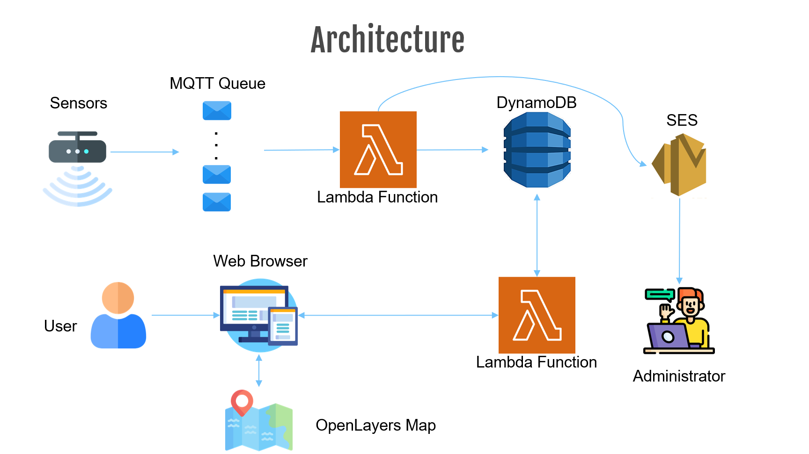

# EzPark

## The Project
Have you ever wondered if there is an easier way to find parking for your car? Well then, EzPark is for you!
With EzPark website, you can have a view of all free parkings in a specific zone of your city or around your actual position. It uses the data collected by IoT sensors, placed each one on a specific parking spot, stored on a Cloud NoSQL Database to show you the nearest free parking spot. 

For now, all sensors are placed in major cities of Campania region (Italy). Sensors send messages on a queue related to its city. Everytime a car parks in/leaves a parking spot, the sensor updates the status of its parking spot on the database. Each sensor sends the following informations:
- ID;
- Latitude;
- Longitude;
- Free/Not Free;
- City;
- Zone;

When an user opens the application Website, he can choose if he wants to see all free parking spots in a specific city and zone, or he can choose to show all free parking spots in a 300m radius from his position. Whatever he chooses, he sends a request to a specific Lambda Function, that retrieves all free parking spots in the zone he chose or around him.

If there are no free parking spot in the zone he chose, the website will show all free spots in a 300m radius from the zone he chose.

## Architecture

- The application is based on AWS Services simulated using [LocalStack](https://localstack.cloud/).
- To operate with all the services that AWS offers, the application uses the AWS SDK written in Python, called [Boto3](https://aws.amazon.com/sdk-for-python/)
- The queues are implemented using [Amazon Simple Queue Service (SQS)](https://aws.amazon.com/sqs/).
- The database is built using [Amazon DynamoDB](https://aws.amazon.com/dynamodb/).
- The functions are Serveless functions deployed on [AWS Lambda](https://aws.amazon.com/lambda/).
- The email is sent using [SES](https://aws.amazon.com/ses/).

## Installation and usage

### Prerequisites
0. [Python3](https://www.python.org/downloads/)
1. [Docker](https://docs.docker.com/get-docker/)
2. [AWS CLI](https://docs.aws.amazon.com/cli/latest/userguide/getting-started-install.html)
3. [boto3](https://boto3.amazonaws.com/v1/documentation/api/latest/guide/quickstart.html)
4. [Node-RED](https://nodered.org/#get-started) for sensors simulation. 
5. [Flask](https://flask.palletsprojects.com/en/2.1.x/quickstart/) used to run the application website `pip install Flask`

### Setting up the environment
**0. Clone the repository**

`git clone https://github.com/AndreaT98/EzPark/EzPark.git`

**1. Launch [LocalStack](https://localstack.cloud/) and Node-RED in a network (in this case "iot")**

`docker run --rm --network iot -it -p 4566:4566 -p 4571:4571 localstack/localstack`

`docker run -itd -p 1880:1880 -v node_red_data:/data --network iot --name mynodered nodered/node-red`

**2. Create a SQS queue for each city (We will create only 3 for now)**

`aws sqs create-queue --queue-name Caserta_sensors --endpoint-url=http://localhost:4566`

`aws sqs create-queue --queue-name Napoli_sensors --endpoint-url=http://localhost:4566`

`aws sqs create-queue --queue-name Salerno_sensors --endpoint-url=http://localhost:4566`

- Check that the queues have been correctly created
	
`aws sqs list-queues --endpoint-url=http://localhost:4566`

**3. Create the DynamoDB table and populate it**
	
1) Use the python code to create the DynamoDB table
	
`python3 ./DatabaseCreation.py`

2) Check that the tables have been correctly created

`aws dynamodb list-tables --endpoint-url=http://localhost:4566`
	
3) Populate the tables with some data
	
`python3 ./DatabasePopulation.py`
	
4) Check that the table have been correctly populated using the AWS CLI (*Press q to exit*)
	
`aws dynamodb scan --table-name Parkings --endpoint-url=http://localhost:4566`

**4. Create the Lambda functions**
1) Create the role

`aws iam create-role --role-name lambdarole --assume-role-policy-document file://role_policy.json --query 'Role.Arn' --endpoint-url=http://localhost:4566`

2) Attach the policy

`aws iam put-role-policy --role-name lambdarole --policy-name lambdapolicy --policy-document file://policy.json --endpoint-url=http://localhost:4566`

3) Create the zip file for each function

`zip Nearest_Parking_Area_Function.zip ./Nearest_Parking_Area_Function.py`

`zip Update_Free_Parking_Areas.zip ./Update_Free_Parking_Areas.py`
	
4) Create the functions

`aws lambda create-function --function-name Nearest_Parking_Area_Function --zip-file fileb://Nearest_Parking_Area_Function.zip --handler Nearest_Parking_Area_Function.lambda_handler --runtime python3.10.3 --role arn:aws:iam::000000000000:role/lambdarole --endpoint-url=http://localhost:4566`

`aws lambda create-function --function-name Update_Free_Parking_Area_Function --zip-file fileb://Update_Free_Parking_Areas.zip --handler Update_Free_Parking_Areas.lambda_handler --runtime python3.10.3 --role arn:aws:iam::000000000000:role/lambdarole --endpoint-url=http://localhost:4566`

**5. Launch the website**
1) Set the environment variable

- Open a shell inside the folder /PyWebsite and set the environment variable as follows:

- In BASH:
`$export FLASK_APP=main.py`

- In Powershell:
`$env:FLASK_APP = "main.py"`

2) Run the application

- `$ flask run`

- The application will start on localhost with port 5000 at:

`http://localhost:5000/`

**6. Test the application**
1) Test the sensors simulation

- Open Node-RED at:
`http://localhost:1880/`

- Import the flow named "EzPark_flow.json"
- Click on the little square to the left of the node "timestamp" to start the simulation
- You can check that the sensors are updated on the database every 30s. To see the changes you can view the DB table as follows:

`aws dynamodb scan --table-name Parkings --endpoint-url=http://localhost:4566`

2) Test the function that calculates the nearest parking spot
- Open the application website

`http://localhost:5000/`

- Select the city and zone you want to see free parking spots and click "Submit"
- If you want to get all free parking spots near the user, click the "Find parkings near me!" anchor.

**7. Trigger an error**

## Future work
- Add more sensors in Campania and other regions of Italy
- Expand the website to implement more features
